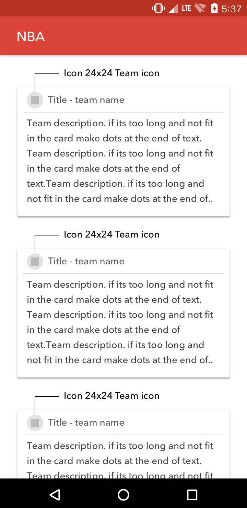
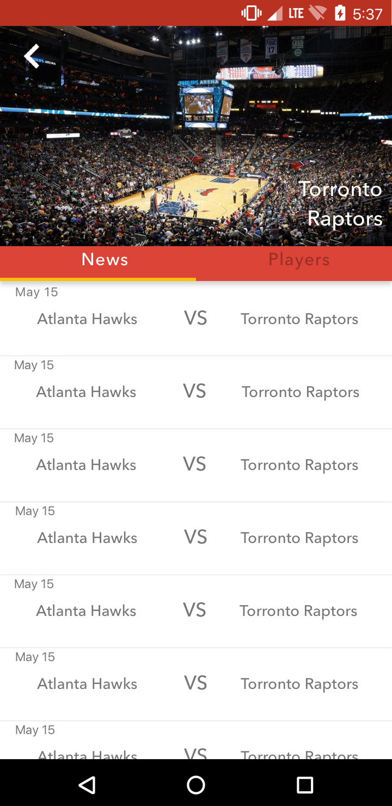
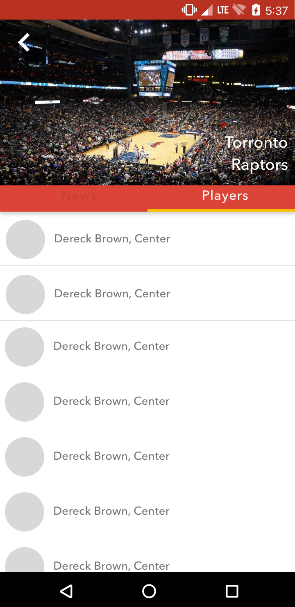
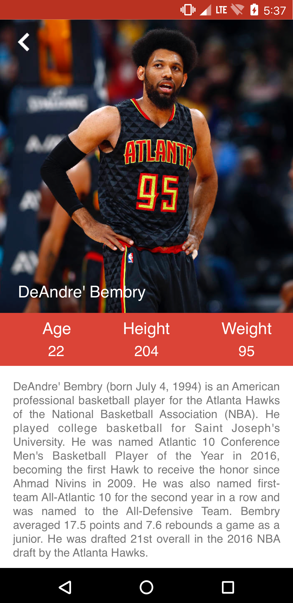

## BasketBallApp - swift

Simple app made to practice unit testing, mocking and other good development practices for iOS

## Built with

* Alamofire
* Realm / Coredata (interchangable)
* OHHTTPStubs

## Screenshots

